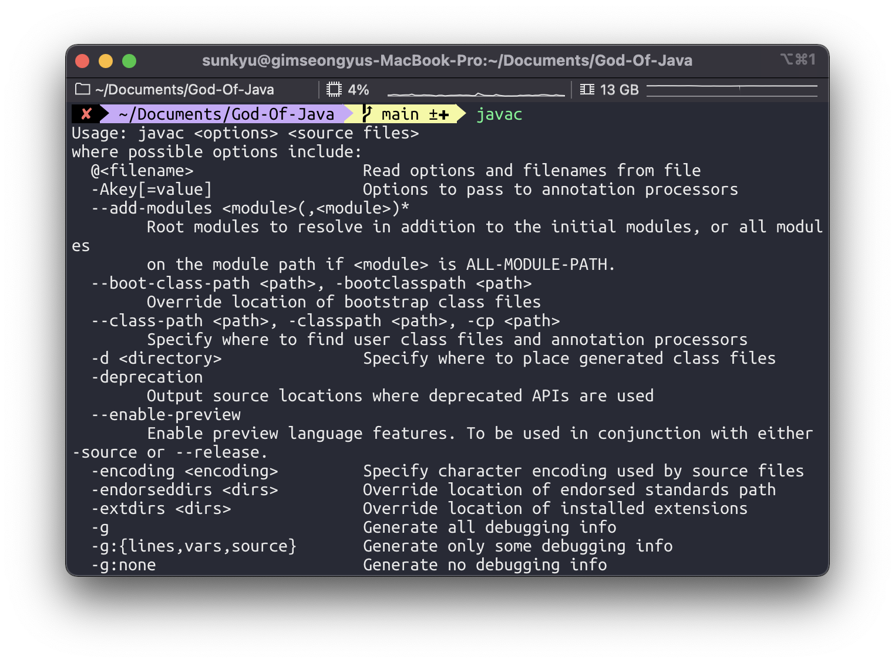

# 2장 Hello God Of Java
## 자바를 배울 환경 준비하기
터미널에서 java를 친 후 엔터를 누르자

터미널에서 javac를 친 후 엔터를 누르자

터미널에서 java --version을 친 후 엔터를 누르자


## Hello God Of Java 만들기
자바 프로그래밍의 경우,  
코드 작성 -> 컴파일 -> 실행  
의 과정으로 진행된다.
  
먼저 에디터에서 코드를 작성하고, 콘솔에서 컴파일 및 실행을 하면 된다.  
여기서 컴파일이라는 것은 javac 명령을 사용하고, 실행은 java 라는 명령을 사용한다.
   
다음과 같은 내용을 입력한다.
```java
public class HelloGodOfJava {
    // 이하 생략
}
```
자바는 대소문자를 엄청나게 따지는 언어이기 때문에 대소문자를 정확히 입력하자.
> .java 라는 확장자로 되어 있는 소스를 컴파일하면 .class 라는 확장자를 가진 파일이 생성되어 디스크에 저장된다.  
> 이 .class 파일은 바이너리 파일로 되어 있기 때문에 에디터에서 열어도 제대로 보기가 어렵다.  
> 컴파일을 하는 프로그램을 컴파일러라고 부르며, 자바에서는 javac 라는 프로그램이 이 역할을 수행한다.  
> 컴파일을 마친 클래스 파일은 JVM에서 읽어서 운영체제에서 실행된다.

## HelloGodOfJava 컴파일하고 실행하기
저장한 파일이 있는지 확인한다.

정상적으로 있다면 javac 명령어를 사용하여 컴파일하자

무소식이 희소식
ls 명령어로 컴파일 확인

java 명령어로 실행


## main 메소드를 만들자

main() 메소드는 다음과 같이 선언되어야 한다.
```java
public static void main(String[] args) {
    // 이하 생략
}
```

이 구문은 반드시 외어야 한다. 이 안의 단어들은 어떤 의미일까?
- public: 접근 제어자 라는 것이다. 일단 무조건 public 이라고 쓰자
- static: 정적인 이라는 뜻이다. 이 단어도 자바의 예약어 중 하나인데, 매우 자주 사용된다.  
    이렇게 메소드를 static 으로 선언하면 객체를 생성하지 않아도 호출할 수 있다.
- void: 메소드 이름 바로 앞에는 그 메소드가 어떤 값을 넘겨줄지를 정한다.  
    그 중에서 돌려줄 것이 없을 때 사용하는 것이 void 다.
- main: 메소드 이름이다. 반드시 이 이름을 써야 한다. 대/소문자 구분도 하니 반드시 이 이름을 사용해야만 한다.
- (String [] args): 메소드 이름 옆에 소괄호 안에 있는 것들은 매개 변수라고 한다.  
    main() 메소드에 전달되는 매개 변수는 반드시 String[] args 여야만 한다.  
    여기서 String 옆에 대괄호를 열었다 닫은 것은 args라는 변수가 배열이라는 말이다.   
    args는 매개 변수의 이름이다. main() 메소드에서 유일하게 바뀌어도 되는 것이 이 args라는 매개 변수 이름이다.  
    sangmin 이라고 해도 되고, good이라고 해도 전혀 상관 없다. 하지만 대부분 args라고 이름을 준다.

> 참고) 배열이란 게 대체 뭐지?  
> 대괄호가 없는 String args는 단칸방 하나라고 보면 된다.  
> 대괄호가 있는 String [] args 는 단칸방들이 모여 있는 고시원이라고 보면 된다.  
> 여러개의 문자열을 한 번에 보내려면 이와 같이 배열이라는 것을 사용하면 된다.

그러면 Hello 클래스에 이 main() 메소드를 추가하자.
```java
public class HelloGodOfJava {
    public static void main(String[] args) {
        
    }
    // 이하 생략
}
```
이제 이 메소드를 넣고 나니 HelloGodOfJava  클래스가 좀 있어 보인다. 이 클래스를 javac로 컴파일하고 java 명령어로 실행해보자

결과를 보기 위해서 main() 메소드에 다음과 같이 한 줄을 추가하자
```java
public class HelloGodOfJava {
    public static void main(String[] args) {
        System.out.println("Hello God Of Java !!!!!");     
    }
    // 이하 생략
}
```
컴파일 하면 다음과 같은 결과가 나타난다.


## System.out.println() 과 System.out.print() 
System.out.println()은 괄호 안의 내용을 출력하고 다음 줄로 넘긴다.
다음과 같이 한 줄을 추가하자.
```java
public class HelloGodOfJava {
    public static void main(String[] args) {
        System.out.println("Hello God Of Java !!!!!");
        System.out.println("I love this book.");
    }
    // 이하 생략
}
```
다시 컴파일을 하고 실행시켜보자

이번에는 println() 대신 print()메소드로 바꿔서 수행해보자
```java
public class HelloGodOfJava {
    public static void main(String[] args) {
        System.out.println("Hello God Of Java !!!!!");
        System.out.print("I love this book.");
    }
    // 이하 생략
}
```

줄이 바뀌지 않는다.

## 주석(comment) 처리하기

### 자바에서의 주석
1. 한줄 주석
   - 한 줄만 주석 처리를 한다.
```java
//
```

2. 블록 주석
   - 여러 줄을 한꺼번에 주석 처리 할 때 사용된다.
```java
/*
 */
```
3. 문서용 주석
    - 자주 사용은 안하지만 문서용 주석이 클래스 선언 바로 앞이나, 메소드 선언 바로 앞에 있으면 문서용 주석으로 인식되어 처리된다.
```java
/**
 * 
 */
```

## 메소드를 직접 만들어 보자

```java
public class Calculator {
    public static void main(String[] args) {
        System.out.println("Calculator class started");
    }
}
```

하나의 메소드는 다음과 같이 여섯 부분으로 나뉠 수 있다.
1. 제어자(modifier): main() 메서드에 있는 public static과 같은 메소드의 특성을 정하는 부분이다.
2. 리턴 타입(return type): 메소드가 끝났을 떄 돌려주는 타입을 말한다.
3. 메소드 이름(method name): 소괄호 앞에 있는 메소드 이름을 말한다.
4. 매개 변수 목록(parameter list): 소괄호 안에 있는 매개 변수의 목록을 말한다.
5. 예외 목록(exception list): 메소드의 소괄호가 끝나는 부분과 중괄호가 시작하는 부분 사이에 예외 목록이라는 것을 선언할 수 있다.
6. 메소드 내용(method body): 중괄호 안에 있는 내용들을 말한다.

