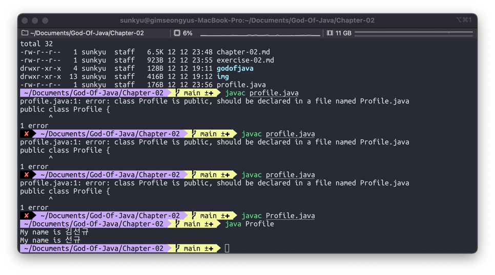

# 2장 연습문제

1. 여러분의 이름을 출력할 Profile 클래스를 만들고, 그 클래스에 main() 메소드를 만들자
```java
public class Profile {
    public static void main(String[] args) {
        
    }
}
```
2. Profile 클래스의 main() 메소드에 "My name is 000" 이라는 값을 출력해 주는 코드를 작성해 보자
```java
public class Profile {
    public static void main(String[] args) {
        System.out.println("My name is 김선규");     
    }
}
```
3. Profile 클래스의 main() 메소드에 "My name is 00" 이라는 값을 출력해 주는 코드를 작성해보자.
```java
public class Profile {
    public static void main(String[] args) {
        System.out.println("My name is 김선규");
        System.out.println("My name is 선규");
    }
}
```
4. Profile 클래스를 컴파일하고 실행하면 다음과 같은 결과가 출력되는 지 확인해보자


---

1. main() 메소드의 메소드 이름 앞에는 어떤 예약어들이 들어 가나요?
   - public staic void 
2. main() 메소드의 매개 변수에는 어떤 값이 들어가나요?
   - String[] args 
3. 만약 여러분들이 만든 클래스에 main() 메소드가 없다면, java 명령어로 그 클래스를 수행할 수 있나요?
   - 수행할 수 없다.
4. System.out.println() 메소드는 어떤 용도로 사용하나요?
   - ()사이에 있는 문자열을 출력한다.
5. System.out.print() 메소드는 System.out.println() 메소드와 어떤 차이가 있나요?
   - ln이 있으면 줄바꿈, 없으면 이어서 출력
6. //는 무엇을 하는 데 사용하는 기호인가요?
   - 한 줄 주석 처리
7. /*로 시작하고, */로 끝나는 사이에 있는 소스들은 어떻게 되나요?
   - 사이에 있는 여러 줄 주석 처리
8. 메소드를 선언할 떄 반드시 꼭 있어야 하는 세 가지는 무엇인가요?
   - 클래스, 예약어, 매개 변수